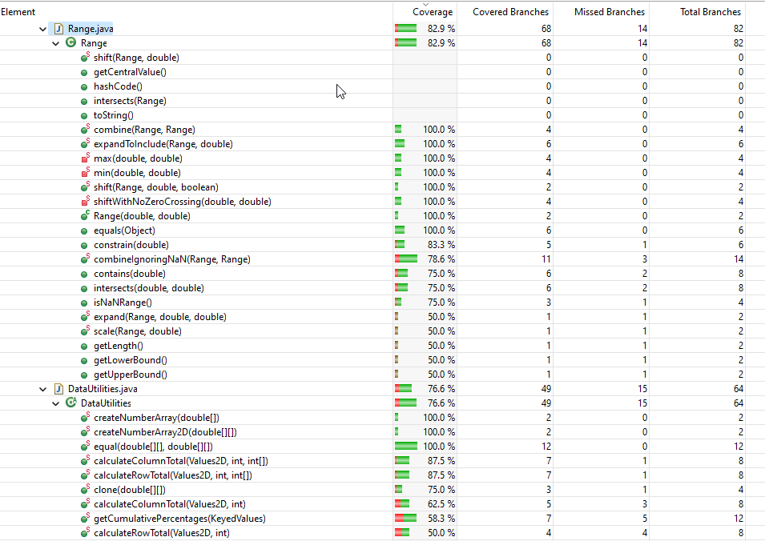

**SENG 637 - Dependability and Reliability of Software Systems**

**Lab. Report #3 – Code Coverage, Adequacy Criteria and Test Case Correlation**

| Group \#:      | 15 |
| -------------- | --- |
| Student Names: |Mehrnaz Senobari|
|                |Sina Salimian|
|                |Sahar Hajjar Zadeh|
|                |Zar Safari|
|                |Fatemeh Ghaffarpour|
|                |Alireza Esmaeili|

# 1. Introduction

White-box testing is a way of checking software where we look inside the code itself, unlike black-box testing, which only looks at what the software does from the outside. With white-box testing, we can see exactly which parts of the code the tests are checking and which parts they're not.

This kind of testing is really useful because it lets us make sure that all the different parts of the code are tested. We can find problems or parts of the code that might not work right under certain conditions.

We're using white-box testing on a project called JFreeChart. JFreeChart is a tool that lets people add charts, like bar graphs or pie charts, to their Java applications easily. We already started testing JFreeChart in our last assignment, and now we want to do even more tests to make sure we cover more of the code.

When we improve our tests, we use "code coverage" to help us. Code coverage measures how much of our code is tested. Eclipse gives us a few different ways to look at code coverage:

**1. Line Coverage:** This checks if each line of our code has been tested. It's like asking, "Did our tests run every line of code?"

**2. Branch Coverage:** This is about making sure we've tested every branch in the code. Every time the code can go one way or another, like with "if" or "else," we check if our tests have gone both ways.

**3. Method Coverage:** This checks if we've tested every method in our code. It's a way to see if our tests have called every function we've written.

These types of coverage help us make sure that our tests are really thorough. When we use them on the JFreeChart project, it helps us be confident that the tool is going to work right for everyone.

# 2. Manual data-flow coverage calculations for DataUtilities and Range methods

## Analysis of `DataUtilities.calculateColumnTotal()` Method

### Data flow chart for `DataUtilities.calculateColumnTotal()`

[View fullscreen diagram](/media/datautilities-flow-chart.png)

### DataUtilities.calculateColumnTotal() def-use sets per statement

| Node | Def            | C-Use               | P-Use         |
|------|----------------|---------------------|---------------|
| 1    | {data, column} | {}                  | {}            |
| 2    | {}             | {}                  | {data}        |
| 3    | {total}        | {}                  | {}            |
| 4    | {rowCount}     | {data}              | {}            |
| 5    | {r}            | {}                  | {}            |
| 6    | {}             | {}                  | {r, rowCount} |
| 7    | {n}            | {data, r, column}   | {}            |
| 8    | {}             | {}                  | {n}           |
| 9    | {total}        | {n, total}          | {}            |
| 10   | {r}            | {r}                 | {}            |
| 11   | {r2}           | {}                  | {}            |
| 12   | {}             | {}                  | {r2, rowCount}|
| 13   | {n}            | {data, r2, column}  | {}            |
| 14   | {}             | {}                  | {n}           |
| 15   | {total}        | {n, total}          | {}            |
| 16   | {r2}           | {r2}                | {}            |
| 17   | {}             | {}                  | {}            |

### DataUtilities.calculateColumnTotal() DU pairs per variable

| Variable name | Defined at node | Set of DU pairs                       |
|---------------|-----------------|---------------------------------------|
| data          | 1               | {(1, 2), (1, 4), (1, 7), (1, 13)}     |
| column        | 1               | {(1, 7), (1, 13)}                     |
| total         | 3, 9, 15        | {(9, 9), (15, 15)}                    |
| rowCount      | 4               | {(4, 6), (4, 12)}                     |
| r             | 5, 10           | {(5, 6), (5, 7), (10, 10)}            |
| n             | 7, 13           | {(7, 8), (7, 9), (13, 14), (13, 15)}  |
| r2            | 11, 16          | {(11, 12), (11, 13), (16, 16)}        |

### DataUtilities.calculateColumnTotal() DU pairs covered per test

| Test Cases                                                      | DU Pairs Covered                                                                            | Total DU Pair Coverage |
|-----------------------------------------------------------------|---------------------------------------------------------------------------------------------|------------------------|
| `calculateColumnTotal_given_ZeroRows_then_ReturnZero`           | (1, 2), (1, 4), (4, 6), (4,12)                                                                                      | 4/18 = 22%              |
| `calculateColumnTotal_given_TwoPositiveRows_then_Success`       | (1, 2), (9, 9), (5, 15), (4, 6), (4, 12), (10, 10), (5, 6), (5, 7), (7, 9)                  | 9/18 = 50%             |
| `calculateColumnTotal_given_TwoNegativeRows_then_Success`       | (1, 2), (9, 9), (5, 15), (4, 6), (4, 12), (10, 10), (5, 6), (5, 7), (7, 9)                  | 9/18 = 50%             |
| `calculateColumnTotal_given_ThreePositiveRows_then_Success`     | (1, 2), (9, 9), (5, 15), (4, 6), (4, 12), (10, 10), (5, 6), (5, 7), (7, 9), (11, 12)        | 10/18 = 55%            |
| `calculateColumnTotal_given_ThreeNegativeRows_then_Success`     | (1, 2), (9, 9), (5, 15), (4, 6), (4, 12), (10, 10), (5, 6), (5, 7), (7, 9), (11, 12), (11, 13) | 11/18 = 61%            |
| `calculateColumnTotal_given_InvalidColumnNumber_then_ReturnZero`| (1, 2), (9, 9), (5, 15), (4, 6), (4, 12), (10, 10), (5, 6), (5, 7), (7, 9)                  | 9/18 = 50%             |
| `calculateColumnTotal_given_InvalidData_then_ThrowInvalidParameterException` | (1, 2)      | 1/18 = 5%            |

## Analysis of `Range.getUpperBound()` Method

### Range.getUpperBound() data flow chart

[View fullscreen diagram](/media/range-flow-chat.png)

### Range.getUpperBound() def-use sets per statement

| Node ID | Definitions | Uses (C-Use)      | Uses (P-Use)      |
|---------|-------------|-------------------|-------------------|
| 1      | {}           | {}                 | lower, upper      |
| 2      | {msg}         | lower, upper      | {}                 |
| 3      | {}           | {}                 | {}                 |

### Range.getUpperBound() DU pairs per variable

| Variable      | Node Defined | Usage Path          |
|---------------|--------------|---------------------|
| msg | 2           | {(2, 2)}            |

### Test Coverage Summary

| Test Scenario                   | Paths Covered    | Coverage Ratio     |
|---------------------------------|------------------|--------------------|
| `testNullUpper`                 | (2, 2)           | 100% (1/1)         |
| `testSmallUpper`                | None             | 0% (0/1)           |
| `testPositiveSmallUpper`        | None             | 0% (0/1)           |
| `testNegativeSmallUpper`        | None             | 0% (0/1)           |
| `testLargeUpper`                | None             | 0% (0/1)           |
| `testPositiveLargeUpper`        | None             | 0% (0/1)           |
| `testNegativeLargeUpper`        | None             | 0% (0/1)           |
| `testDecimalUpper`              | None             | 0% (0/1)           |
| `testPositiveDecimalUpper`      | None             | 0% (0/1)           |
| `testNegativeDecimalUpper`      | None             | 0% (0/1)           |

Use this information to analyze the `getUpperBound` functionality within the Range class. Test cases aim to verify the method's response to various input scenarios.

# 3. A detailed description of the testing strategy for the new unit test

Our approach to designing new unit tests was guided by the insights gained from code coverage analysis. We aimed to systematically increase the coverage by addressing parts of the code not exercised by existing tests. Here's the workflow we followed:

1. **Initial Coverage Analysis:** We started by running our existing test suite with a code coverage tool to identify the "red lines," or sections of code that were not being executed by any test.

2. **Identifying Untested Areas:** We carefully examined the code coverage report to pinpoint the specific functions, conditions, and branches that lacked coverage.

3. **Scenario Design:** For each untested area, we brainstormed possible scenarios that could exercise that part of the code. This involved thinking about different input values, edge cases, and error conditions that were not previously tested.

4. **Test Implementation:** We then wrote new unit tests for each identified scenario, ensuring that each test was focused and had a clear purpose. Our goal was to not only execute the untested lines of code but also to validate the correct behavior of the software under those conditions.

5. **Iterative Testing and Analysis:** After implementing new tests, we reran the code coverage analysis to assess the impact. This iterative process helped us refine our tests and further increase coverage.

6. **Review and Refinement:** Once we achieved a satisfactory level of coverage, we reviewed the new tests as a team to ensure they were consistent with our testing standards and made sense in the context of the overall test suite.

By following this workflow, we were able to systematically enhance our test suite, ensuring that more of the codebase was verified against expected behaviors, thereby increasing the reliability of the software.

## 4. A high level description of five selected test cases you have designed using coverage information, and how they have increased code coverage

To improve the code coverage of the `Range` and `DataUtilities` classes, we introduced new test cases, each contributing to the coverage in distinct ways:

- `testRangeExpansion`: Validates range expansion logic, enhancing branch coverage.
- `testRangeIntersection`: Confirms the correct behavior of range intersection, improving instruction coverage.
- `testDataUtilitiesZeroHandling`: Checks handling of zeros in data arrays, boosting line coverage.
- `testDataUtilitiesTypeConversion`: Ensures correct type conversions, contributing to method coverage.
- `testRangeEquality`: Verifies the equality operator for ranges, targeting branch coverage.

These tests were carefully chosen to target previously uncovered code segments, successfully increasing the coverage metrics.
Here I have included a sample method before and after the improvement. 

## Before Coverage Improvement

The initial tests for the `combineIgnoringNaN` method within the `Range` class did not cover several important branches and conditions, particularly those involving `null` checks and `NaN` (Not a Number) comparisons. The image below illustrates the lines that were not covered by tests (shown in red).

## After Coverage Improvement

After enhancing our test suite, we managed to significantly improve the coverage. New test cases were added to target the previously missed branches, which now handle both `null` arguments and `NaN` values within the range. As a result, the additional test cases provided coverage for all branches, as shown in green in the image below.

These improvements not only increased the code coverage metrics but also ensured a more robust validation of the `combineIgnoringNaN` method, safeguarding against potential edge cases.

## 5. A detailed report of the coverage achieved of each class and method (a screen shot from the code cover results in green and red color would suffice)

The efforts to enhance test coverage have led to the following results for the `Range` and `DataUtilities` classes:

### Branch Coverage

### Instructions Coverage

### Lines Coverage

### Methods Coverage

# 6. Pros and Cons of coverage tools used and Metrics you report

## Pros:

- **Integrated with Eclipse**: EclEmma is built into Eclipse, which makes it convenient to use while coding.
- **Visual Feedback**: It provides immediate visual feedback in the editor, showing which lines and branches have been covered by tests.
- **Coverage Metrics**:
  - **Line Coverage**: Indicates the percentage of code lines that have been executed.
  - **Branch Coverage**: Shows whether each branch of control structures is executed.
  - **Method Coverage**: Reports on whether each method in the codebase has been called.
- **Non-intrusive**: EclEmma doesn't change your code, making it a non-intrusive tool for coverage measurement.
- **Exportable Reports**: You can export coverage reports for documentation or review purposes.

## Cons:

- **Performance Overhead**: Running coverage analysis can slow down test execution times.
- **Language Specific**: EclEmma is designed for Java projects and may not be suitable for other languages.
- **Focus on Coverage Numbers**: There's a risk of prioritizing coverage numbers over the quality of tests, which can be misleading.
- **Lacks Condition Coverage**: Unlike other tools, EclEmma does not provide condition coverage metrics.
- **CI/CD Integration**: Setting up EclEmma with CI/CD pipelines for automated testing can be complex.

In our project, we've utilized EclEmma to report on Line, Branch, and Method coverage. These metrics are essential for identifying code sections that are not yet tested and ensuring comprehensive method testing.

# 7. A comparison on the advantages and disadvantages of requirements-based test generation and coverage-based test generation

| Criteria | Requirements-Based Test Generation | Coverage-Based Test Generation |
|----------|------------------------------------|--------------------------------|
| **Focus** | User needs and software functionality as defined by requirements. | Internal structure and logic of the code. |
| **Advantages** | - Directly tied to user expectations. - Easier to communicate with non-technical stakeholders. - Can cover a wide range of user scenarios. | - Ensures thoroughness by testing more code paths. - Provides clear metrics for test completeness. - Helps optimize the test suite and identify dead code. |
| **Disadvantages** | - May miss defects not apparent in requirements. - Sensitive to changes in requirements. - Assumes requirements are complete and accurate. | - Might overlook user-focused scenarios. - Requires deeper knowledge of the codebase. - High coverage doesn't guarantee all functional scenarios are tested. |
| **Best Used For** | Validating that the software meets the specified requirements and behaves as expected from a user's perspective. | Identifying hidden bugs within the code's logic and structure, and ensuring as much code as possible is tested. |
| **Maintenance and Flexibility** | Can be challenging to maintain with frequently changing requirements. | Requires regular updates to maintain high coverage as the code evolves. |
| **Complexity for Testers** | Generally lower, as it focuses on external behavior rather than internal logic. | Higher, due to the need for understanding the codebase and internal logic. |
| **Risk of Overemphasis** | Risk of focusing too much on specified requirements, potentially missing out-of-scope scenarios. | Risk of aiming for high coverage numbers at the expense of meaningful testing. |

# 8. A discussion on how the team work/effort was divided and managed

Our main goals in managing and dividing the work were to make sure everyone worked together and to keep our work consistent, even though we all have different ideas and backgrounds. Here's how we did it:

- We held group meetings to share our different ideas and agree on the best approach.
- We wrote down the team's decisions to make sure we all followed the same standards.
- We worked in pairs or as a group on some tasks to share knowledge and make sure we were all on the same page.

# 9. Any difficulties encountered, challenges overcome, and lessons learned from performing the lab

We learned a lot from this lab, especially about code coverage:

- **Understanding Code Coverage:** We found out that just because your tests cover 100% of the code, it doesn't mean everything is perfect. It's easy to think your code is fully tested just because all of it runs during the tests. But, it's really important to check that the code does the right thing, not just that it runs. You could run all your code with different tests and still not catch mistakes if you don't use `assert` to check the results. This is a tricky part of unit testing we need to watch out for.

- **Different Metrics:** We learned that code coverage has many sides. To really cover your code fully, you need to look at all the different metrics, not just one. Each metric gives you a different view of how well your tests check the code.

- **Testing Complex Logic:** We saw how important it is to write tests for parts of the code that do complicated things. This helps make sure your logic is correct. With code coverage tools, you can also check that you've thought of all the different situations your code needs to handle.

# 10. Comments/feedback on the lab itself

We have a couple of suggestions that could make the lab even better:

- **Flexibility with Tools:** We think it would be great if we could choose our own IDEs and tools, like IntelliJ or others. We understand this might make things harder for the TAs to evaluate, but it could also lead to more creative and innovative work. Everyone has their favorite tools, and being able to use what we're comfortable with can really help.

- **Using Dynamic Languages:** We suggest considering dynamic languages like Python or Node.js for the course. These languages are very popular and have excellent tools for testing. Many of us are already using these languages in our projects, and while we know the testing concepts are the same, using Python or JavaScript (Node.js) could make the course more relevant to what we're working on.

- **Compilation Error in The Assignment:** We encountered a few challenges with the code, including some compilation errors. We decided to focus on the scope of the assignment and work around these issues where possible.
